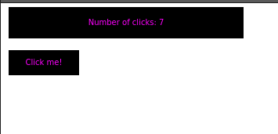

# Solovar

Status: spike

Solorvar is a play around attempt to make an Immediate Mode UI framework using Javascript (Well, Typescript) in the style of [ImGUI](https://github.com/ocornut/imgui) or [Nuklear](https://github.com/Immediate-Mode-UI/Nuklear). Immediate Mode UIs are used in games programming, tend to be very fast, and minimize bloat and state.

If you've never heard of an Immediate Mode UI, [this video](https://caseymuratori.com/blog_0001) is a quick primer about how they work.

An example of using Solovar:

```javascript
const state = {
  clicks: 0,
};

//             / selector to canvas element
solovarInit(".immediate", (ctx: UIContext, t: number) => {
  // Solorvar UI
  {
    solovarStart(ctx);
    const label = `Number of clicks: ${state.clicks}`;
    widgetLabel(ctx, "1", [10, 5, 300, 40], label);
    if (widgetLabel(ctx, "2", [10, 60, 90, 32], "Click me!")) {
      state.clicks += 1;
    }
    solovarEnd(ctx);
  }
});
```

Will create a clickable "button" and show:



See `src/demo.ts` for more information.
